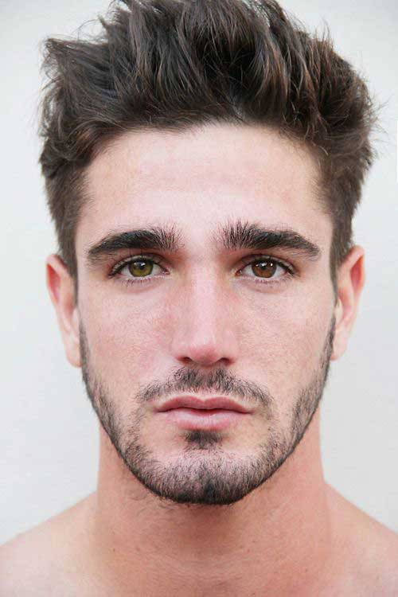
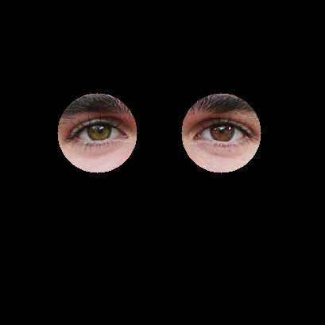
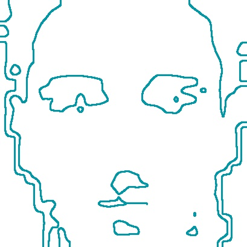
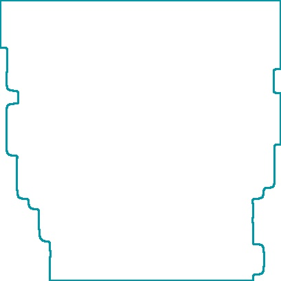
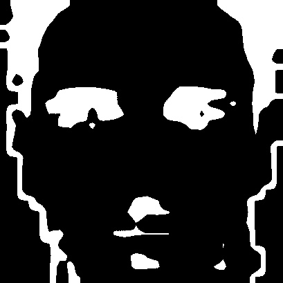

This folder contains functions related to feature detection of a human face.  
Functions are included to take an original image and subsample to create  
a low resolution image. The purpose of this was to experiment with image  
super resolution. Ideas included the possibility of extracting features  
from the low resolution image to blend/create details extracted from  
high resolution examples.  
Included topics are:  
- Contours
- Thresholding
- Subsampling
- Heatmaps
- Haarcascade detection

Original image:  
  
Background removed, face identified, subsampled to create low quality:  
  
Eyes detected:   
  
Contours, all and outer:    
   
  
heatmap used to identify facial regions:  
  
get blue color channel from heatmap, threshold the blue parts  
to identify feature locations  

