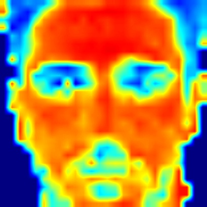

The project includes
- discrete fourier transforms and work in frequency domain
- low pass and high pass filters
- Haarcascade detection

Original image:  
  
Background removed, face identified, subsampled to create low quality:  
  
Eyes detected:   
  
Contours, all and outer:    
   
  
heatmap used to identify facial regions:  
  
get blue color channel from heatmap, threshold the blue parts  
to identify feature locations  

