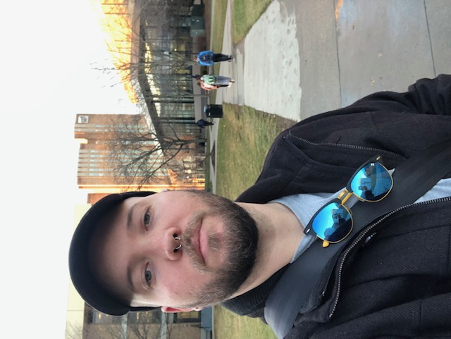
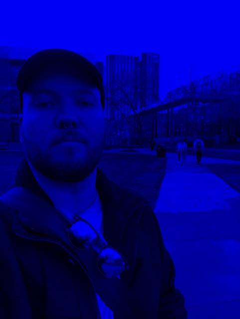
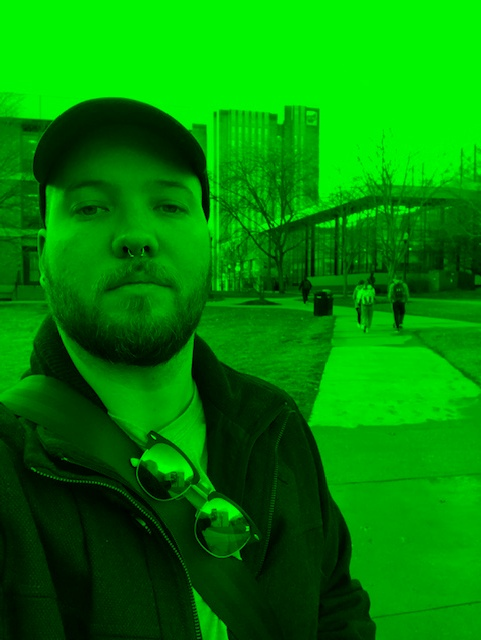
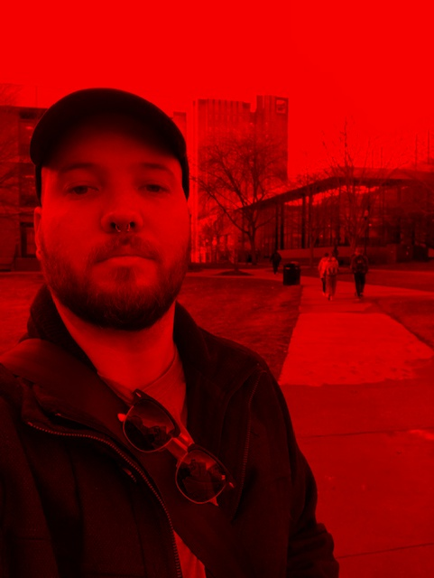
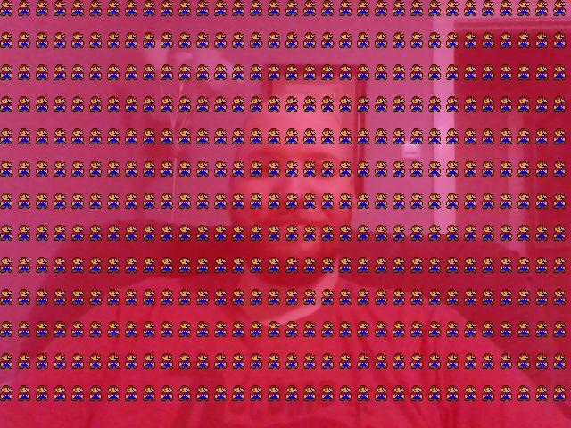
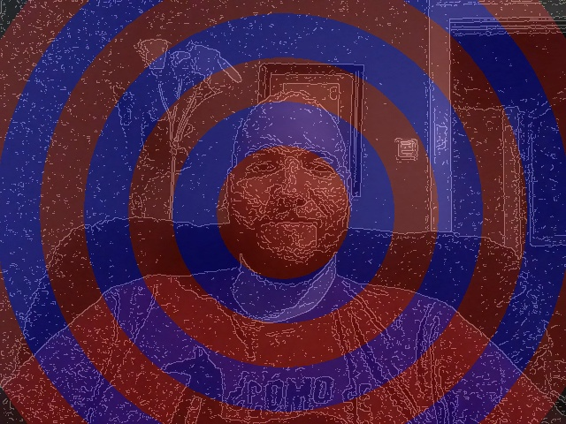

This project demonstrates various image processing techniques. Some include
- Image loading, displaying, and saving
- Down sampling
- Up sampling
- Custom pixel averaging 
- Creating a filter
- Drawing small Marios on an image
- Separating BGR color channels
- Using web cam
- and more

First Original Image from phone:  
  
Split Color Channels:  
  
  
  
Second Original Image from webcam:  
.jpg)  
Workings on second image  
  
  
