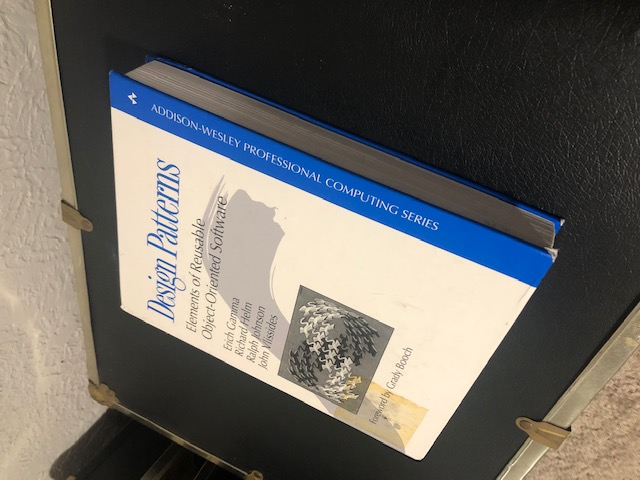
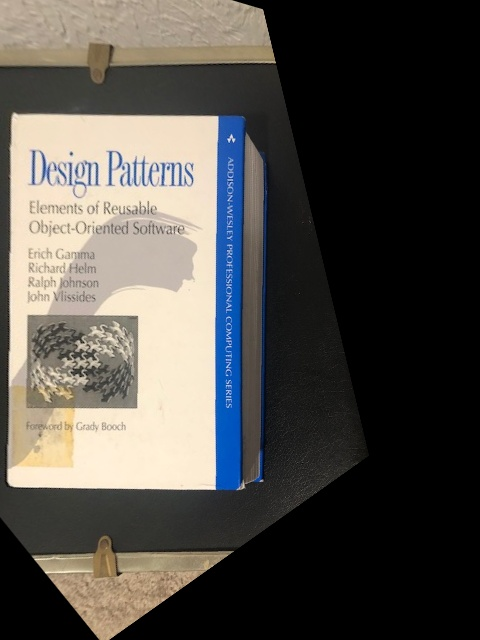
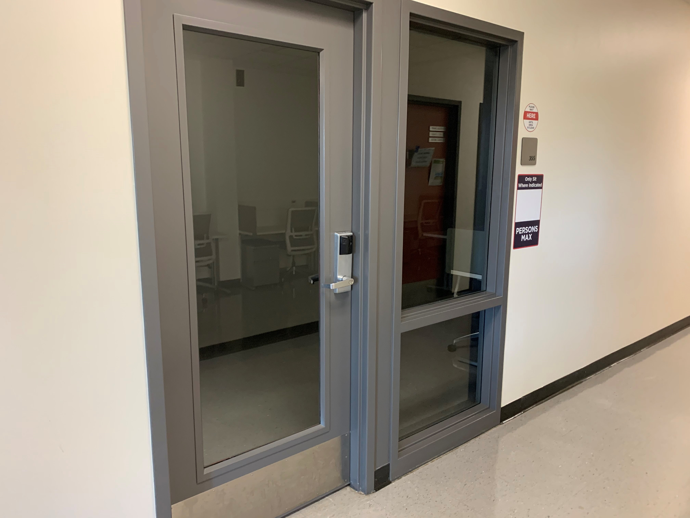
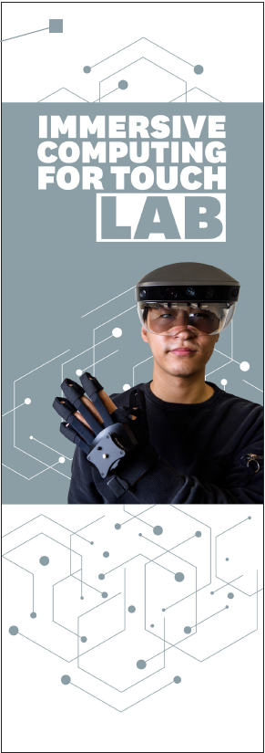
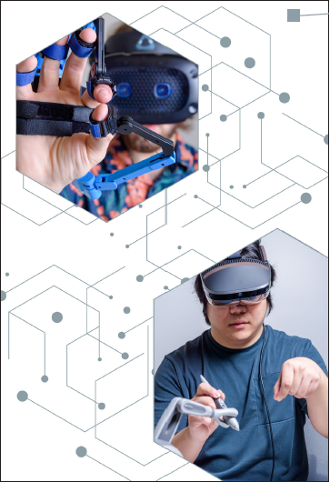
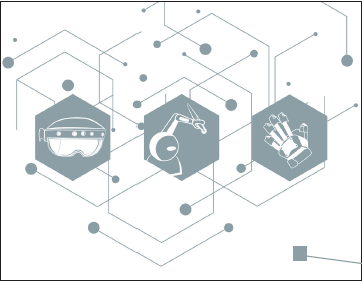
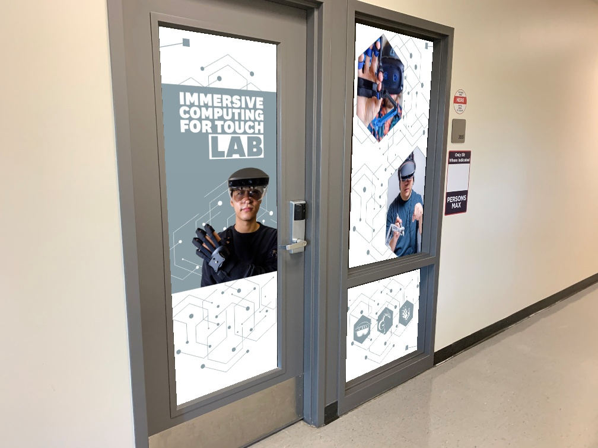

This project includes
- Image histograms
- Equalization
- warping perspective of images
- mapping warped perspectives from one image to another
- and more

Removing perspective from a book:

Warping graphics onto door
Original Door:

Original Graphics:

New Door:

