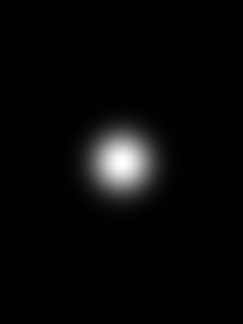
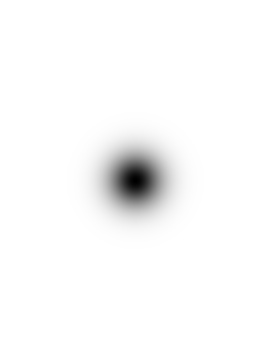
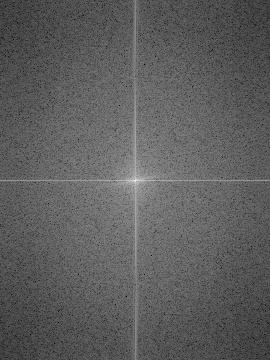
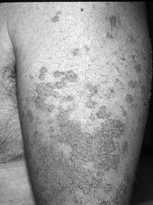
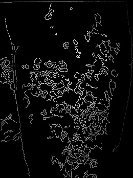
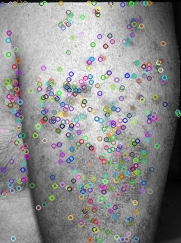
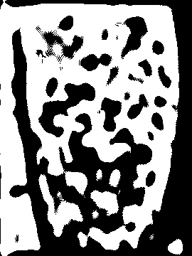

The project includes
- discrete fourier transforms and work in frequency domain
- low pass and high pass filters
- SIFT feature detection
- Canny edge detection

Low pass and high pass filters used in frequency domain represented in BGR domain:  
 
 
Example of frequency magnitude shown in BGR domain:  
 
Examples of custom feature detection, along with SIFT and Canny  
Original  
 
Detections  
 
 
 

